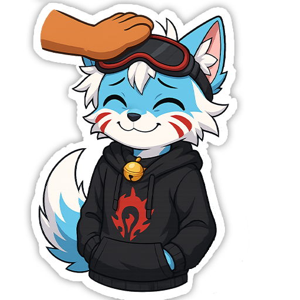

  

  

  

  

    
    
    
  

---

## 🚀 Обо мне

- 🎮 Разрабатываю **хоррор-игры**, **👁 Психологические хорроры** на **Unity**  
- 📱 Опыт в **Android**, **PC**, **Web** 
- 🔧 Использую **C#**, **DOTween**, **State Machines**, **Shaders**  
- 👨‍💻 Работаю **в одиночку**

---

## ⚡ Навыки и технологии

### 🎮 **Game Development**

### 🔧 **Инструменты**

### 📱 **Платформы**

### ⚙️ **Производительность и оптимизация**

---

  <picture>
    <source media="(prefers-color-scheme: dark)" srcset="https://raw.githubusercontent.com/Zzerud/Zzerud/refs/heads/output/github-contribution-grid-snake-dark.svg" />
    <source media="(prefers-color-scheme: light)" srcset="https://raw.githubusercontent.com/Zzerud/Zzerud/refs/heads/output/github-contribution-grid-snake.svg" />
    
  </picture>

---
## 📫 Как со мной связаться?

  

  

